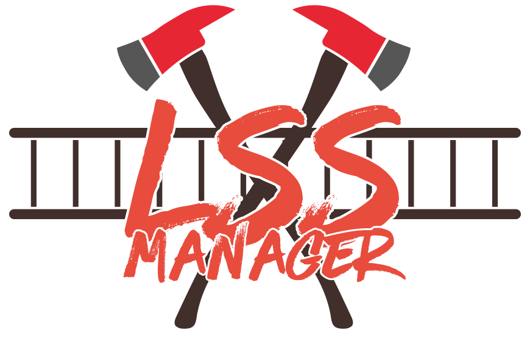

# LSS-Manager V.4

*[][1]
This work is licensed under a [Creative Commons Attribution-NonCommercial-ShareAlike 4.0 International License (CC BY-NC-SA 4.0) ][1]*

**It is forbidden to use code of the LSS-Manager to violate the terms and conditions of Leitstellenspiel.de or one of its other language versions!**

Der LSS-MANAGER V.4 ist eine Erweiterung für das Leitstellenspiel.de und dessen anderssprachige Versionen.

Mit dieser Erweiterung wird ein Appstore zum Spiel hinzugefügt, welcher das Installieren von Plugins ermöglicht. Dabei sind alle Funktionen modular aufgebaut - man kann bis auf den letzten Baustein bestimmen, was alles aktiviert werden soll.

### Wiki
In unserem [Wiki](https://v4.lssm.ledbrain.de) findest du alles zur Installation, die FAQ und eine Erklärung aller Funktionen.

### Support Server

Klicke einfach auf das Banner unten um zu unserem Support Discord Server zu gelangen!

## Haftung / Sonstiges

Die Nutzung des Scripts geschieht auf eigene Gefahr. Wir haften nicht für eventuell auftretende Schäden oder ähnliches, die durch die Nutzung dieses Scripts entstanden sind. SHPlay GmbH ist in keinster Weise für den Inhalt des Scripts verantwortlich.

## Contributors ✨

Thanks goes to these wonderful people ([emoji key](https://allcontributors.org/docs/en/emoji-key)):

<!-- ALL-CONTRIBUTORS-LIST:START - Do not remove or modify this section -->
<!-- prettier-ignore-start -->
<!-- markdownlint-disable -->
<table>
  <tr>
    <td align="center"><a href="https://github.com/KBOE2"> <b>Jan</b></a> <a href="https://github.com/KBOE2/LSSM-V.4/commits?author=KBOE2" title="Code">💻</a> <a href="#maintenance-KBOE2" title="Maintenance">🚧</a> <a href="#mentoring-KBOE2" title="Mentoring">🧑‍🏫</a> <a href="#projectManagement-KBOE2" title="Project Management">📆</a> <a href="#question-KBOE2" title="Answering Questions">💬</a></td>
    <td align="center"><a href="https://github.com/CSA-Verweigerer"> <b>CSA-Verweigerer</b></a> <a href="#ideas-CSA-Verweigerer" title="Ideas, Planning, & Feedback">🤔</a> <a href="#userTesting-CSA-Verweigerer" title="User Testing">📓</a></td>
    <td align="center"><a href="https://github.com/KokosnussDEV"> <b>KokosnussDEV</b></a> <a href="https://github.com/KBOE2/LSSM-V.4/commits?author=KokosnussDEV" title="Documentation">📖</a> <a href="https://github.com/KBOE2/LSSM-V.4/commits?author=KokosnussDEV" title="Code">💻</a></td>
    <td align="center"><a href="https://github.com/Ron31"> <b>Ron31</b></a> <a href="https://github.com/KBOE2/LSSM-V.4/commits?author=Ron31" title="Code">💻</a> <a href="#question-Ron31" title="Answering Questions">💬</a></td>
    <td align="center"><a href="https://github.com/Suchty112"> <b>Suchty112</b></a> <a href="#question-Suchty112" title="Answering Questions">💬</a> <a href="#translation-Suchty112" title="Translation">🌍</a></td>
  </tr>
</table>

<!-- markdownlint-restore -->
<!-- prettier-ignore-end -->
<!-- ALL-CONTRIBUTORS-LIST:END -->

This project follows the [all-contributors](https://github.com/all-contributors/all-contributors) specification. Contributions of any kind welcome!

[1]: http://creativecommons.org/licenses/by-nc-sa/4.0/
