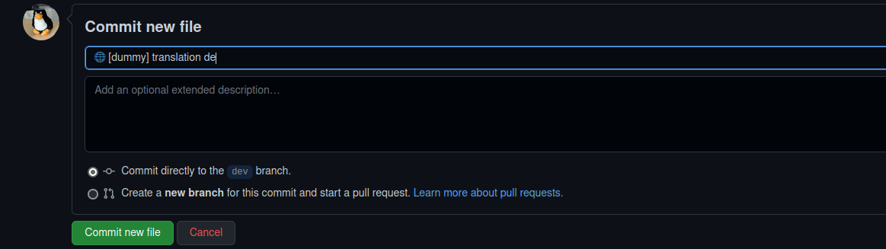

# Committing a file

After you changed a file you need to write a commit message. If you want to make us happy please
use [gitmojis](https://gitmoji.dev) followed by the module name in square brackets and a quick summary (half sentence)
what you changed (eg. translations). Some long module names got unofficial abbreviations over the development.

## Abbreviation list

| Abbreviation | Module                    | Submodule               |
|--------------|---------------------------|-------------------------|
| dcs          | dailyCreditsSummary       |                         |
| eb           | extendedBuilding          |                         |
| ab           | asyncButtons              |                         |
| blf          | buildingListFilter        |                         |
| ecl          | extendedCallList          |                         |
| ecw          | extendedCallWindow        |                         |
| emv          | extendedCallWindow        | enhancedMissingVehicles |
| tt           | extendedCallWindow        | tailored Tabs           |
| ai           | extendedCallWindow        | alarm icons             |
| mk           | extendedCallWindow        | mission keywords        |
| em           | extendedMap               |                         |
| ge           | generalExtensions         |                         |
| mh           | missionHelper             |                         |
| sap          | ShareAlliancePost         |                         |
| docs         | docs (main pages only)    |                         |
| etr          | enhancedTransportRequests |                         |
| hk           | hotkeys                   |                         |

:::tip What's next?

* Read [Test locally](./runningLocally.md)
* Read [how to create a Pull Request](./prs.md)
* Read one of the special sections for contribution topics
  :::
