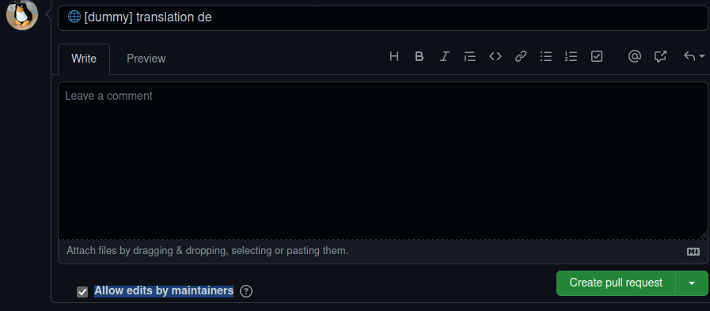

# Creating a PullRequest

When you feel ready for your changes to be made available for beta-testers, it's time to transfer your improvements into the LSSM repository.
This may be after updating a single module, a simple wiki-page, many modules or just after doing small fix to existing translations.
GitHub will show you a messages in your repository.

Click on "contribute" and "Open pull request"

This will lead you to an overview where you can see all your changes. Please make sure that you merge in the right repository (LSS-manager/LSSM-V.4) and in the right branch (dev)

You can also set a title for the Pull Request, if you don't know any good: copy the commit message.

:::tip How to make the LSSM-Team happy
* donating chocolate (even virtual chocolate is fine :chocolate_bar::yum:)
* giving the Pull Request (PR) a meaningful title, sticking to the scheme `🔀{gitmojis} [{module}] {short_description}`
    * We will sometimes change the title but if you are providing a good one from the beginning, chances are lower
    * If you want to make us even happier, also add the flag of your translation after the globe `🌐` (e.g. `🇨🇿` for lang `cs_CZ`), when doing translations

:::

**Make sure that the checkbox "Allow edits by maintainers" is set**, otherwise, LSSM-Team is not able to make any changes and provide quick-fixes.

Now somebody needs to review your changes and an automated build-system will check that there will be no syntax errors (missing comma, bracket, etc.).

If the review and the check is positive it will be merged into the development branch and your code is live for the beta testers. With the next release it will be available for every user.

**Congrats, you contributed to the LSSM, thank you for your support!**

:::tip What's next?
* Read one of the special sections for contribution topics

:::
