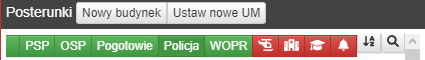
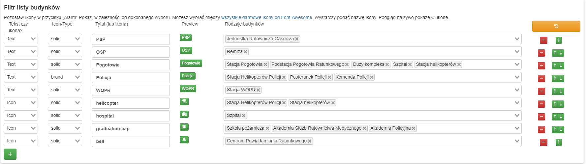

Ten moduł pozwala dostosować i dodać filtry do listy budynków.

Masz możliwość dodania dodatkowych filtrów nad listą budynków. Będziesz w stanie:

* Wybrać ikonę lub tekst dla każdego filtra
* Dodać własne filtry
* Wybierać, które budynki mają być wyświetlane dla każdego filtra

Przykład:

Ekran ustawień:

