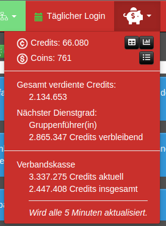
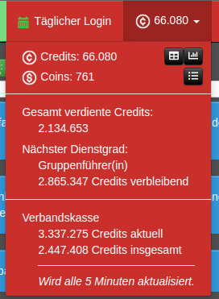
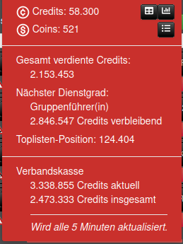
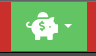
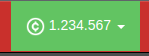

Die **Creditserweiterung** der V3 ist nun auch in der V4 verfügbar!

Sie fügt ein nützliches Menü in die Navigationsleiste ein,
 anstelle von Credits und Coins und hat ein paar kleine Einstellungs- und Anpassungsmöglichkeiten:

## Credits statt Sparschwein

Zeigt die aktuellen Credits anstelle eines Sparschweins an.

|      **inaktiv** (Standard)      |                    **aktiv**                     |
|:--------------------------------:|:------------------------------------------------:|
|  |  |

## Toplisten-Position in Creditserweiterung

Zeigt deine aktuelle Position in der Topliste an. Der Wert wird alle 5 Minuten aktualisiert:

## Ziele

Jedes Mal, wenn du eines der eingestellten Credits-Ziele erreicht hast,
 wird das Sparschwein bzw. der Creditsstand grün hervorgehoben, bis du das nächste Mal darauf klickst:

|                     Sparschwein                     |                      Credits                      |
|:---------------------------------------------------:|:-------------------------------------------------:|
|  |  |
