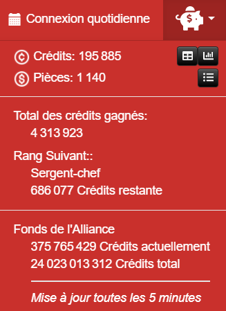
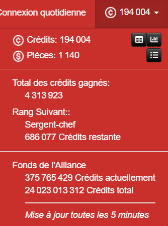
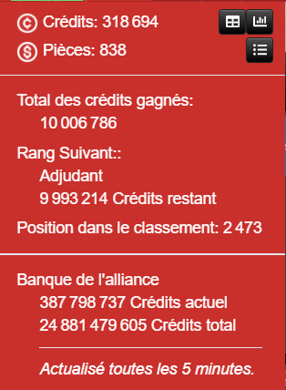
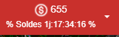
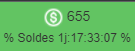

L'extension **Crédits** de la V3 est maintenant aussi disponible dans la V4 !

Elle ajoute un menu utile dans la barre de navigation, à la place des crédits et des pièces,
 et possède quelques petites options de réglage et de personnalisation :

## Crédits au lieu de tirelire

Affiche les crédits actuels au lieu d'une tirelire.

|   **inactif** (par défaut)    |                     **actif**                      |
| :---------------------------: | :------------------------------------------------: |
|  |  |

## Position dans le classement en crédit

Affiche ta position actuelle dans le classement. La valeur est mise à jour toutes les 5 minutes :

## Affiche les soldes

Affiche les soldes de pièces lorsqu'elles sont disponibles.

## Mettre en évidence les soldes

Surligne les pièces en vert si des soldes est disponible

## Objectifs

Chaque fois que vous avez atteint l'un des objectifs de crédits définis,
 la tirelire ou le niveau de crédits est mis en évidence en vert jusqu'à ce que vous cliquez dessus la prochaine fois :

|                       Tirelire                       |                    Crédits                    |
| :--------------------------------------------------: | :-------------------------------------------: |
|  |  |
