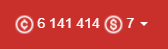
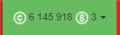

**Rozszerzenie kredytów** V3 jest teraz dostępne również w V4!

Umieszcza przydatne menu na pasku nawigacyjnym zamiast kredytów i monet oraz ma kilka małych ustawień i opcji dostosowywania:

## Kredyty zamiast skarbonki

Wyświetla aktualne kredyty zamiast skarbonki.

|      **Nieaktywne** (domyślnie)       |                   **Aktywne**                    |
| :-----------------------------------: | :----------------------------------------------: |
|  |  |

## Toplista w rozszerzeniu kredytów

Pokazuje Twoją aktualną pozycję na topliście liście. Wartość jest aktualizowana co 5 minut:

## Cele

Za każdym razem, gdy osiągniesz jeden z wyznaczonych celów kredytowych,
 świnka skarbonka lub saldo kredytów będą podświetlone na zielono, dopóki na nie nie klikniesz:

|                   Świnka skarbonka                    |                        Kredyty                        |
| :---------------------------------------------------: | :---------------------------------------------------: |
|  |  |
