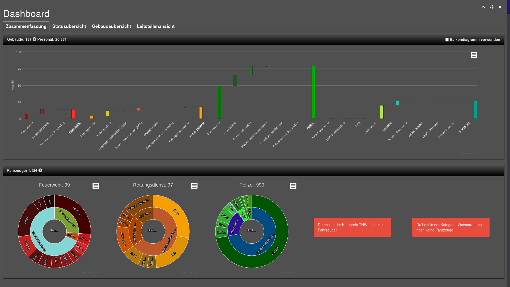
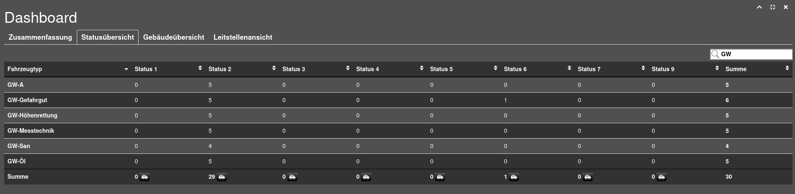
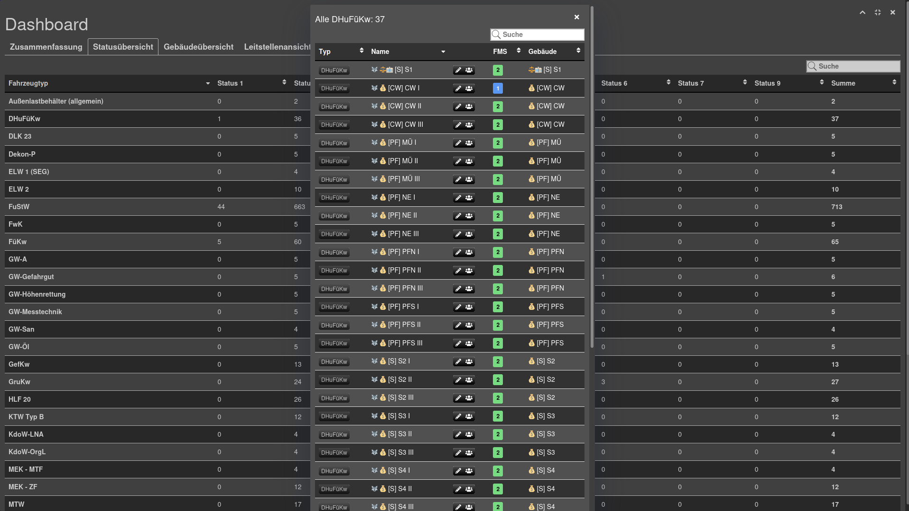
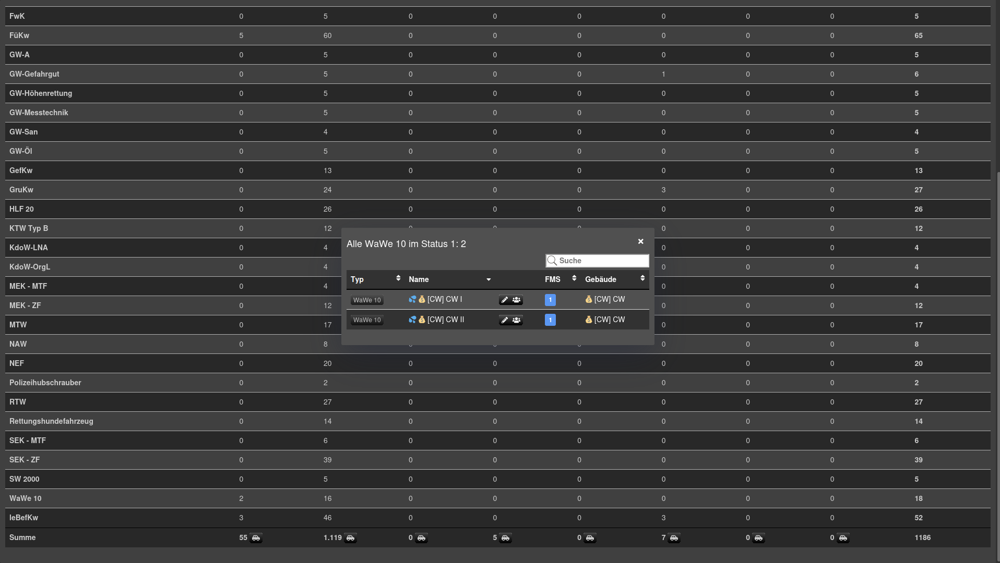
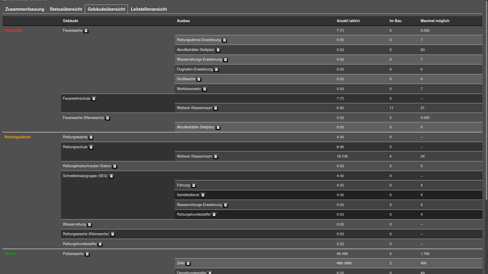

## Zusammenfassung

Die Zusammenfassung soll dir einen schnellen Überblick über die Zahl deiner Gebäude und Fahrzeuge geben.

### Gebäude

Klickst du in der Gebäudeübersicht auf eine Kategorie (z.B `Rettungsdienst`),
 so werden nur die Gebäude der jeweiligen Kategorie angezeigt.

Anschließend bietet ein Klick auf einen Gebäudetyp eine Übersicht über die Zahl der Fahrzeuge an Gebäuden dieses Typs.

### Fahrzeuge

Auch bei den Fahrzeugen gibt es Gruppierungen.
Ein Klick auf eine Gruppe (z.B: `Bereitschaftspolizei-Fahrzeuge`) zeigt nur Fahrzeugtypen dieser Gruppierung an.
Somit erhälst du besser den Überblick über einzelne Fahrzeugkategorien.

## Statusübersicht

In der Statusübersicht findest du eine Tabelle,
 in der du sehen kannst, von welchem Fahrzeugtyp du wie viele Fahrzeuge hast und ebenfalls wie viele welchen Status haben.
Die Tabelle lässt sich Filtern und sortieren.

Unter der Tabelle findet sich ein kleines Icon. Ein Klick darauf öffnet & schließt ein Kreisdiagramm,
 welches die aktuelle Status-Verteilung visualisiert:

Fährt man mit der Maus über eine Tabellenzelle erscheint ein Knopf, mit welchem man eine Fahrzeugliste öffnen kann.
Hier ein paar Beispiele:

### Alle Fahrzeuge eines Typs

### Alle Fahrzeuge eines Typs in einem bestimmten Status

### Alle Fahrzeuge in einem Status

## Gebäudeübersicht

Die Gebäudeübersicht listet auf, welche Gebäudetypen du hast und in welcher Menge.
Ebenfalls kannst du die Zahl der Ausbauten einsehen:

Über die "Gebäude"-Knöpfe lassen sich Listen ansehen:

### Alle Gebäude eines Typs

### Alle Gebäude mit einem bestimmten Ausbau

## Leitstellenansicht

:::danger Noch in Entwicklung
Die Leitstellenansicht ist noch in Entwicklung und funktioniert deshalb nicht wirklich gut derzeit :)
:::
