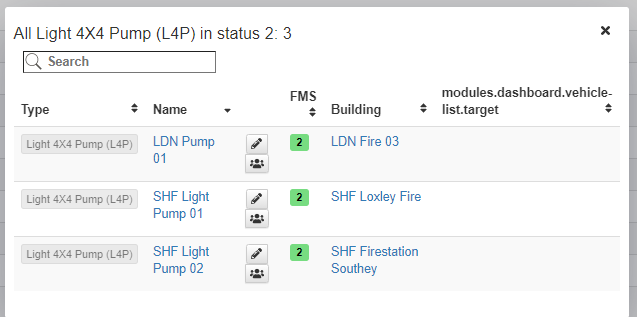

## Riepilogo

Il riepilogo ti darà una rapida panoramica degli edifici e veicoli.

### Edifici

Se si fa clic su una categoria nella panoramica edificio (ad esempio `Vigili del fuoco`),
 gli edifici della rispettiva categoria verranno mostrati.

Se si fa clic su un tipo di edificio, verrà visualizzata una panoramica del numero di veicoli che si trovano in tali edifici.

### Veicoli

Se si fa clic su un gruppo di veicoli (ad esempio `HART`) nella panoramica del veicolo,
 mostrerà solo i tipi di veicoli di questo gruppo.

## Panoramica dello Stato

Nella panoramica dello stato vedrete il vostro tipo di veicolo, quantità e quanti sono in ogni stato.

Se si passa il mouse sopra una cella nella tabella, un pulsante apparirà dove è possibile aprire un elenco più dettagliato.

### Tutti i veicoli di un tipo

### Tutti i veicoli di un tipo in uno stato

### Tutti i veicoli in uno stato

## Panoramica degli Edifici

La panoramica dell'edificio elenca i tipi di edificio e quanti. Mostra anche informazioni sulle estensioni.

Lo stesso come con la panoramica del veicolo, il pulsante verrà visualizzato quando si passa sopra una cella.

### Tutti gli edifici di un tipo

### Tutti gli edifici con un'estensione specifica

