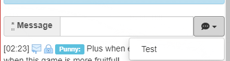
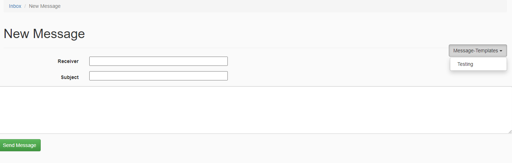

This is a pretty simple module, designed to make it easier to send reptitive messages, this is especially useful for (co-)admins.

## Chat-Messages

These are messages to be inserted into the alliance chat. They won't be automatically sent, alllowing you to edit them beforehand.

## Templates

These are templated for private messages, these support the variables.

## Variables

### Username
`{{username}}` can be used to insert the recipients username.

::: warning New Messages Only
This variable only works in new messages, as it is not possible for us to get the recipient from existing messages
:::

### Date

`{{today}}` can be used to insert todays date.
If you wish to insert another date, you can use `{{today+7}}` to insert a date 7 days in the future, or `{{today-7}}` to insert a date 7 days in the past.
