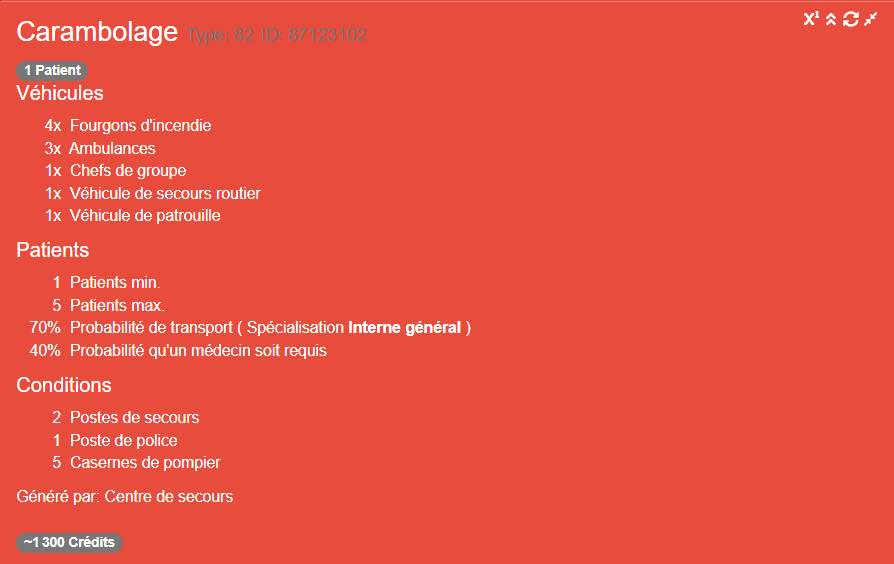
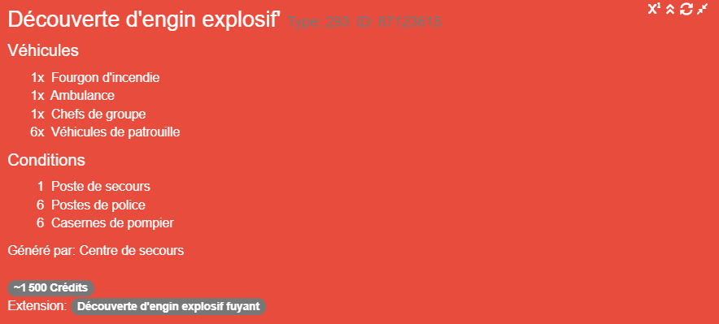
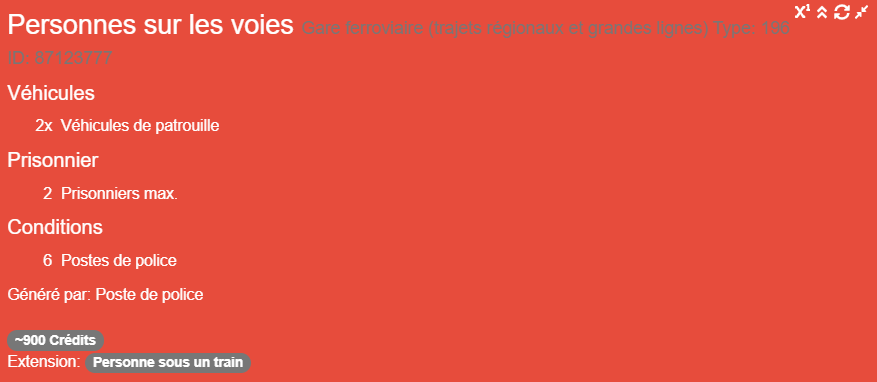

## Général

Il est parfois utile de pouvoir voir immédiatement les exigences d'un appel.
Ce module crée un bel aperçu de toutes les exigences et autres données d'une alerte.

Si l'aide de mission se charge mais n'affiche aucune donnée,
vous pouvez essayer de la recharger en appuyant sur le bouton de rechargement.
  
Si vous souhaitez détacher l'aide de mission de l'écran de notification,
afin de pouvoir la déplacer, appuyez sur le bouton suivant :
  
Si vous voulez réduire l'aide à la mission à une petite taille où les informations sont cachées,
appuyez sur le bouton suivant :
  
Si vous voulez voir le nombre maximum de ressources possibles, cliquez sur le bouton suivant :

## Exemples

