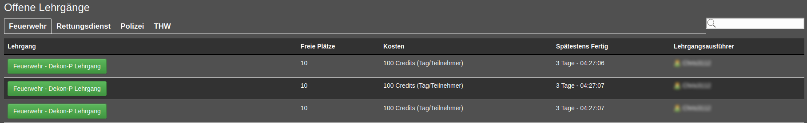

Speciellt i stora föreningar blir listan över tillgängliga kurser snabbt mycket lång.
Om du deltar i många utbildningar även då kommer du snabbt att tappa koll på vad som händer.

Med modulen 'Kursöversikt' försöker vi lösa detta problem.

Överst hittar du ett litet "i" som öppnar en sammanfattning.
Naturligtvis har vi integrerat en sökfunktion och tabellerna kan sorteras. Hela saken ser ut så här:

Dessutom är kurserna med egna deltagare och öppna kurser indelade i kategorier.
Det betyder helt enkelt enligt respektive skolor, dvs.

* Brandkår
* Polis

Och alltid i den här ordningen.
Återigen har vi inbyggt sorteringsalternativ och sökfunktioner så att du snabbt kan hitta rätt kurs.

Så här ser det till exempel ut för kurser med dina egna deltagare:

Och så med öppna kurser:

