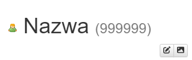

Chcesz szybko poznać swój własny identyfikator użytkownika i uzyskać dostęp do swojego profilu za pomocą jednego kliknięcia?
Moduł „Identyfikator użytkownika” umożliwia Ci to poprzez dodanie linku do swojego profilu w pasku nawigacyjnym.
Aby uniknąć przepełnienia paska nawigacyjnego, funkcję tę można wyłączyć w ustawieniach,
poprzez `Pokaż swój identyfikator na pasku nawigacyjnym`.

Ponadto na profilu każdego użytkownika wyświetlany jest jego identyfikator.

