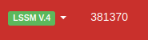
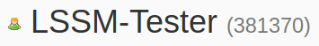

Vill du veta ditt eget användar-ID snabbt och komma åt din profil med bara ett klick?
Med "User-ID" -modulen kan du göra detta genom att lägga till en länk till din profil i navigeringsfältet.
För att undvika överfyllning av navigeringsfältet kan denna funktion inaktiveras i inställningarna,
via 'Visa eget ID i navigeringsfältet 'aktiveras (de).

Dessutom visas respektive användares ID i varje profil.

